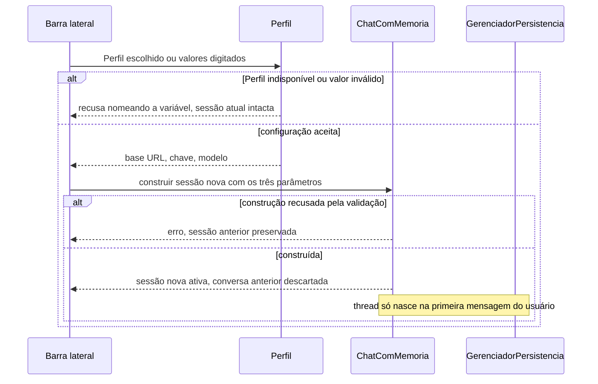

# Troca de provedor de LLM em runtime

> Plan from this document. Each slice below carries its own shape - copy it, do not re-derive it.
> Status: confirmed by jonatasvieiracoutinho, 2026-09-27

## Situation

- Project: not shipped yet. Projeto educacional, usuário único, sem público externo.
- Decision: committed by jonatasvieiracoutinho, 2026-09-27, no pedido que abriu esta sessão.
- In flight: o padrão de injeção por parâmetro do construtor, já usado pela persistência, é o precedente que esta feature copia. Fica fora o provedor AWS Bedrock nativo, que tem plano próprio e um branch parado desde junho, e cuja retomada exigiria rebase sobre tudo que entrou depois.
- At stake: revertível em uma tarde, com uma exceção. A assinatura do construtor de `ChatComMemoria` é consumida pela CLI, pela tela e pelos exemplos, então mudar a forma do override depois custa mais do que escolhê-la agora.

## Problem

Quem sente o custo é você, testando provedor compatível com a API OpenAI a partir da tela. Hoje a troca custa três passos manuais fora do app: editar o `.env`, matar o processo do Streamlit e subir de novo. O restart não é opcional, é consequência de duas coisas somadas: a leitura do `.env` não sobrescreve variável já presente no ambiente do processo, e o cliente da API é construído uma vez na criação de `ChatComMemoria`. Efeito colateral de cada troca: a sessão do navegador morre junto, e com ela a conversa em andamento.

Custo por rodada de comparação, não instrumentado e informado por você: um ciclo de edição de arquivo mais um restart por provedor testado, mais o retrabalho de refazer a conversa de teste do zero em cada ida e volta. Nada disso é medido pelo projeto, que não tem telemetria; a evidência é o procedimento manual, que existe e é observável no `.env` sendo editado.

Se nada mudar, testar um provedor novo continua sendo uma tarefa de arquivo e terminal em vez de uma escolha na tela, e comparar dois provedores na mesma sessão continua impossível.

## Success

- Worked if: escolher outro provedor e mandar a primeira mensagem contra ele acontece sem editar `.env` e sem reiniciar o processo, dentro de uma única sessão do navegador.
- Going wrong: você volta a editar o `.env` porque o campo que precisava trocar não está no Perfil.

## Boundary

In: troca de provedor pela barra lateral do app Streamlit, para provedores compatíveis com a API OpenAI (OpenAI, Azure OpenAI, Ollama, LM Studio, OpenRouter, Groq e equivalentes).

Out:
- Provedor AWS Bedrock nativo: tem plano e branch próprios, parados, e depende de um backend que não existe no `main`.
- Troca de provedor na CLI: lá a troca por `.env` antes de subir já é o fluxo natural e não paga restart de sessão de navegador.
- `temperature` e `max_tokens` no Perfil: continuam vindo do ambiente, onde as ressalvas de modelo de reasoning já estão documentadas.
- Gravar o provedor na thread: decisão sua, sem vínculo, então sem coluna nova e sem migração.
- Persistir em disco o Perfil escolhido ou os valores digitados: o override é de sessão, e gravar chave em arquivo novo é risco sem ganho para teste.

Unchanged: `GerenciadorPersistencia` e o schema do banco, incluindo `threads` e `turnos`. A estimativa aproximada de tokens, o sliding window e o monitoramento de limite. A ordem de precedência dos quatro parâmetros opcionais que o construtor de `ChatComMemoria` já aceita. `exemplos_avancados.py`, que consome apenas a interface pública.

## Shape

O registro é o Perfil: três valores, base URL, chave e modelo, vindos de blocos nomeados no ambiente ou digitados na tela. A operação é construir um `ChatComMemoria` novo contra o Perfil escolhido, descartando a conversa anterior. A porta é a assinatura do construtor de `ChatComMemoria`, que ganha três parâmetros com a mesma precedência dos quatro que já existem: mudar essa forma depois custa reescrever os três chamadores atuais.

A alternativa pesada extrai a configuração de provedor para uma classe própria, com um discriminador de tipo de provedor, e ganha se o Bedrock voltar a ser prioridade, porque aí provedor deixa de ser só endpoint e passa a ser backend.

## Key decisions

1. **O override entra por parâmetro do construtor de `ChatComMemoria`, e nenhum caminho de código escreve no ambiente do processo.** É o mesmo padrão que a persistência usa e que o AGENTS.md declara canônico. A alternativa, mutar variáveis de ambiente em volta da construção, contamina todo o processo, inclusive uma segunda sessão na mesma execução, e deixa as mensagens de validação mandando o usuário corrigir um `.env` que não é a origem do valor.

2. **Precedência: parâmetro vence ambiente, e ausência de parâmetro preserva o comportamento atual byte a byte.** Construir sem os três parâmetros novos tem que produzir exatamente o objeto de hoje, com as mesmas validações e as mesmas mensagens de erro citando o `.env`. Quando o valor vem por parâmetro, a mensagem de recusa não pode mandar editar o `.env`.

3. **Um Perfil são exatamente três valores: base URL, chave e modelo.** Trocar endpoint sem trocar modelo não funciona na prática, porque o nome do modelo é específico do provedor. Os demais parâmetros de geração continuam sendo do ambiente, fonte única.

4. **A lista de Perfis declarada no ambiente é a autoridade sobre quais Perfis existem, e um Perfil declarado com bloco incompleto aparece como indisponível nomeando a variável que falta.** Nunca desaparece em silêncio, e nunca impede o app de subir: um erro de digitação em um Perfil que você não vai usar não pode derrubar a tela inteira.

5. **Trocar de Perfil descarta a conversa em andamento, e nenhuma thread guarda qual provedor a gerou.** O banco não muda. Como a thread só é criada na primeira mensagem do usuário, trocar de Perfil sem ter mandado mensagem não deixa thread órfã no banco.

6. **A chave nunca chega a disco, log, export ou tela, e é substituída por máscara em qualquer texto de erro antes da exibição.** Hoje a chave já não é impressa nem logada em nenhum modo, inclusive debug. Essa é a única propriedade que a mensagem de erro fixa existia para proteger, e ela precisa sobreviver à remoção dessa mensagem.

7. **A tela passa a exibir o erro técnico da exceção, substituindo a mensagem fixa decidida em setembro.** Decisão anterior superada a seu pedido, depois de eu apontar o conflito: sem o texto da exceção não há como distinguir URL errada de chave inválida de modelo inexistente, que é justamente o diagnóstico que um teste de provedor precisa. Os testes que hoje travam o texto fixo passam a travar a mascaração da chave.

## Work

| Slice | Delivers | Status |
|---|---|---|
| [Perfil](#perfil) | Conjunto de Perfis nomeados, validados, disponível em runtime | clear |
| [ChatComMemoria override](#chatcommemoria-override) | `ChatComMemoria` construível contra qualquer endpoint sem tocar no ambiente | clear |
| [Seletor de Provedor](#seletor-de-provedor) | Troca de provedor pela barra lateral, sem restart | open, 1 default tomado |
| [Erro de provedor na tela](#erro-de-provedor-na-tela) | Falha de provedor diagnosticável na tela, com a chave mascarada | clear |

Order: Perfil → ChatComMemoria override → Seletor de Provedor → Erro de provedor na tela.

Already handled by existing code: mensagem vazia ou só espaço não chama a API e não altera histórico; a fala do usuário continua visível quando o envio falha; a thread é criada na primeira mensagem do usuário, não na construção da sessão.

Derivable from the repository, left to the plan: docstrings em português, PEP 8, mensagens de erro acionáveis nomeando a variável e o valor recebido, lógica testável separada do wiring de widgets, e teste ao lado dos existentes, tudo como o parâmetro `gerenciador` e `GerenciadorPersistencia` já fazem.

### Perfil

**Delivers** a lista de Perfis nomeados que a tela pode oferecer, lida e validada a partir do ambiente. **Status: clear.**

Glossário: um Perfil é um nome mais três valores, base URL, chave e modelo. Declaração no ambiente: uma variável lista os nomes existentes, e cada nome tem um bloco de três variáveis com o nome como parte do identificador. A entrada `Padrão (.env)` sempre existe e é montada a partir das variáveis obrigatórias que o projeto já usa.

| State | What should happen | Caller sees |
|---|---|---|
| Lista de Perfis ausente ou vazia | Nada declarado, nenhum Perfil extra | Seletor com uma opção só, `Padrão (.env)` |
| Nome listado com bloco completo | Entra no seletor, na ordem em que aparece na lista | O nome do Perfil |
| Nome listado com variável faltando | Perfil marcado indisponível, app continua no ar | Aviso nomeando o Perfil e a variável que falta |
| Base URL do Perfil sem `http://` nem `https://` | Mesma recusa que o ambiente já aplica hoje | Aviso nomeando o Perfil e a URL recebida |
| Nome listado duas vezes | Uma entrada só no seletor | O nome uma vez |

Alternatives considered: descoberta por varredura de prefixo, sem lista declarada. Ganha se o número de Perfis crescer ao ponto de manter a lista incomodar, e perde hoje porque nome digitado errado sumiria sem erro.

### ChatComMemoria override

**Delivers** `ChatComMemoria` aceitando chave, modelo e base URL por parâmetro, com a validação intacta. **Status: clear.** Esta é a porta: os três parâmetros novos entram na assinatura consumida pela CLI, pela tela e pelos exemplos.

Key decision 1 e Key decision 2 governam este slice.

| State | What should happen |
|---|---|
| Nenhum dos três parâmetros passado | Objeto idêntico ao de hoje: valores do ambiente, mesmas validações, mesmas mensagens citando o `.env` |
| Os três passados | Ambiente ignorado para esses três; validação de formato de URL e de obrigatoriedade continua valendo sobre o valor recebido |
| Parcial, só base URL por exemplo | O que não veio por parâmetro vem do ambiente |
| Chave passada vazia ou em branco | Recusa, e a mensagem não manda editar o `.env`, porque o `.env` não é a origem do valor |
| Base URL passada sem esquema http | Recusa, mesma regra do ambiente, nomeando o valor recebido |
| Ambiente sem a chave obrigatória e chave passada por parâmetro | Construção bem-sucedida: a ausência no ambiente deixa de ser fatal quando o valor chega por parâmetro |

Alternatives considered: mutar o ambiente do processo em volta da construção. Ganha se a assinatura do construtor fosse intocável, o que não é o caso, e perde por Key decision 1.

### Seletor de Provedor

**Delivers** a troca de provedor na barra lateral, dentro da sessão do navegador, sem editar arquivo e sem restart. **Status: open, 1 default tomado.**

Key decision 5 governa o descarte da conversa. A barra lateral exibe o Perfil ativo com base URL e modelo, nunca a chave.

| State | What should happen | Caller sees |
|---|---|---|
| Primeira carga da sessão | Sessão construída do ambiente, como hoje | Seletor em `Padrão (.env)`, Perfil ativo com base URL e modelo |
| Troca de Perfil com conversa em andamento | Conversa descartada, `ChatComMemoria` novo construído contra o Perfil | Tela de conversa limpa, Perfil novo ativo |
| Troca de Perfil sem ter mandado nenhuma mensagem | Nenhuma thread fica no banco | Tela limpa |
| Escolha da entrada digitada, campos vazios | Nada é trocado, sessão atual intacta | Campo obrigatório sinalizado |
| Escolha da entrada digitada, URL inválida | Nada é trocado, sessão atual intacta | Erro nomeando a URL recebida |
| Escolha de Perfil marcado indisponível | Nada é trocado, sessão atual intacta | A variável que falta naquele Perfil |
| Retomar thread antiga com persistência ligada | Usa o Perfil selecionado no momento, não o que gerou a thread | Histórico carregado, Perfil ativo inalterado |
| Ambiente obrigatório incompleto na carga inicial | App não sobe, igual a hoje | Erro de configuração citando a variável |
| Valores digitados após recarregar a página do navegador | Perdidos, sessão volta ao `Padrão (.env)` | Seletor no padrão |

A ordem importa e é o que este slice garante: a sessão atual só é descartada depois que a configuração nova é aceita.

Open, default taken:
1. A carga inicial ainda exige o ambiente obrigatório completo, então o app não sobe sem uma chave válida no `.env` mesmo que você só queira usar um Perfil local sem chave. Default tomado: manter a exigência, porque o `Padrão (.env)` é construído no start. Alternativa, subir direto no seletor sem sessão padrão, ganha se você quiser rodar só contra Ollama sem nenhuma chave OpenAI declarada.

Alternatives considered: prefixar o título da thread com o nome do Perfil. Ganha se comparar provedores depois virar rotina, e fica fora hoje por Key decision 5, sem vínculo entre thread e provedor.

### Erro de provedor na tela

**Delivers** falha de provedor diagnosticável na tela, com a chave mascarada. **Status: clear.**

Key decision 6 e Key decision 7 governam este slice. Substitui a decisão de setembro que fixou o texto genérico.

| State | What should happen | Caller sees |
|---|---|---|
| Endpoint inacessível | Conversa preservada, fala do usuário continua visível, sem bolha de assistente | Texto da exceção, com a chave mascarada |
| Chave rejeitada pelo provedor | Idem | Texto da exceção, com a chave mascarada |
| Modelo inexistente no provedor | Idem | Texto da exceção, com a chave mascarada |
| Texto da exceção contendo a chave ativa | Chave substituída por máscara antes de chegar à tela | Erro com a chave mascarada |
| Mensagem vazia ou só espaço | Não chama a API, não altera histórico | Nada, como hoje |

Alternatives considered: exibir categoria do erro em vez do texto bruto. Ganha se a tela passar a ser usada por alguém que não é você, e perde hoje porque a categoria perde o detalhe que o provedor escreve e que é o conteúdo do diagnóstico.

## Sources

- `AGENTS.md`, seção de padrão de extensão de `ChatComMemoria`: estabelece injeção por parâmetro do construtor como padrão, com a persistência como caso canônico.
- `env.example`: estabelece que provedores compatíveis via base URL já são caso de uso declarado do projeto, com Azure, Ollama e LM Studio nomeados.
- `docs/planos/2026-06-18-bedrock-provider.md`, no branch parado: estabelece o que fica fora, e por que provedor como backend é um desenho diferente de provedor como endpoint.
- `.specs/features/adicionar-tela-streamlit-659323ea/` e `.specs/features/fala-do-usu-rio-no-chat-s-aparece-quando-o-assis-a52b11c8/`: os dois carregam o erro sanitizado como requisito em notação EARS, e os dois são superados por Key decision 7.
