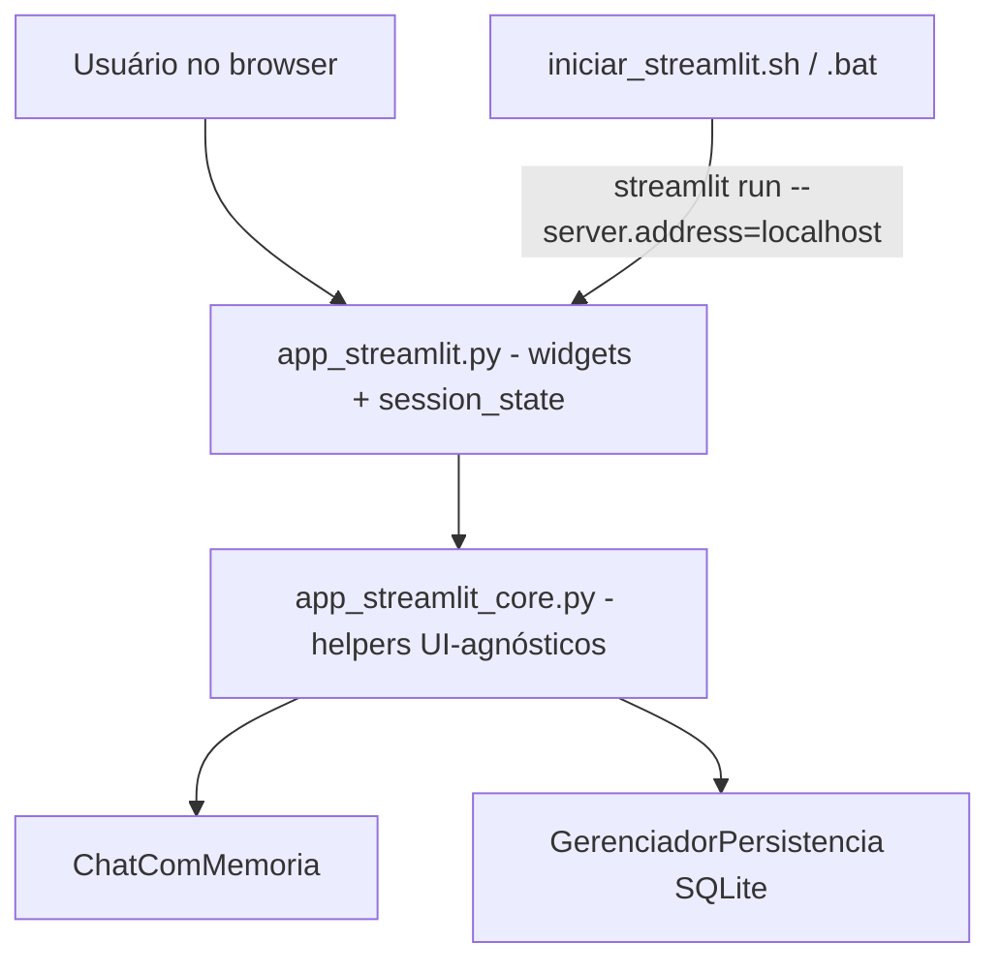

# Front-end Streamlit com Scripts de Inicialização Design

**Spec**: `.specs/features/adicionar-tela-streamlit-659323ea/spec.md`
**Status**: Draft

---

## Architecture Overview

Camada fina de UI sobre a lógica existente. `app_streamlit.py` só faz *wiring* de widgets Streamlit; toda a regra reutilizável e UI-agnóstica vive em `app_streamlit_core.py`, que delega para `ChatComMemoria`/`GerenciadorPersistencia` sem duplicar negócio. Essa separação torna a lógica testável por unidade sem importar `streamlit` e mantém a app fina.

`st.session_state` guarda `chat` (instância de `ChatComMemoria`), `thread_id` e o histórico derivado, sobrevivendo às reexecuções do script a cada evento (PRD seção 8).

---

## Code Reuse Analysis

### Existing Components to Leverage

| Component | Location | How to Use |
| --------- | -------- | ---------- |
| `ChatComMemoria` (`enviar_mensagem`, `limpar_historico`, `contar_tokens_aproximado`, `exportar_conversa`, `historico`, ctor `gerenciador=`/`thread_id=`) | `chat_openai_memoria.py:109` | Importar e reutilizar; nunca reimplementar |
| `GerenciadorPersistencia` (`listar_threads`, `carregar_historico`, `excluir_thread`, `thread_existe`, `total_tokens_thread`) | `persistencia.py:7` | Importar quando `PERSISTENCIA_SQLITE=true` |
| Padrão de ativação de `.venv` + erro claro | `iniciar_chat.bat:5` | Espelhar em `iniciar_streamlit.bat`/`.sh` |
| Padrão de teste (mock `OpenAI`, `patch.dict` env, `GerenciadorPersistencia(":memory:")`) | `tests/test_integracao_chat.py:21` | Reusar para novos testes |

### Integration Points

| System | Integration Method |
| ------ | ------------------ |
| OpenAI (via `ChatComMemoria`) | Chamada síncrona `enviar_mensagem()`, `OPENAI_STREAM` desligado na UI |
| SQLite (via `GerenciadorPersistencia`) | Mesmo esquema/DB; sem alteração de schema |
| Configuração `.env` | Reuso integral; `OPENAI_API_KEY` permanece server-side |

---

## Components

### `app_streamlit_core.py` (novo módulo UI-agnóstico)

- **Purpose**: Fornecer helpers testáveis que encapsulam a interação com `ChatComMemoria`/`GerenciadorPersistencia` sem qualquer dependência de `streamlit`.
- **Location**: `app_streamlit_core.py` (raiz)
- **Interfaces**:
  - `persistencia_ativa() -> bool` — lê `PERSISTENCIA_SQLITE` do ambiente.
  - `construir_sessao_chat(gerenciador=None, thread_id=None) -> ChatComMemoria` — instancia `ChatComMemoria`, com `gerenciador`/`thread_id` quando a persistência está ativa. Reusa ctor existente.
  - `sanitizar_erro(exc: Exception) -> str` — mensagem amigável fixa, sem chave/stack/detalhes.
  - `enviar_mensagem_seguro(chat, texto: str) -> tuple[str|None, str|None]` — `(resposta, None)` no sucesso; `(None, msg_sanitizada)` na exceção; ignora texto vazio/branco.
  - `historico_para_ui(chat) -> list[tuple[str, str]]` — pares `(role, content)` a partir de `chat.historico`.
  - `resumo_tokens(chat) -> dict` — `{"aproximado": int, "total_persistido": int|None}` via `contar_tokens_aproximado()` e, sob persistência com `thread_id`, `total_tokens_thread()`.
  - `exportar_conversa_texto(chat) -> tuple[str, str]` — usa `exportar_conversa()` gravando em arquivo de `tempfile`/`mktemp`, lê e devolve `(nome_sugerido, conteudo)`.
  - `listar_threads(gerenciador) -> list[dict]` — repassa `listar_threads()`.
  - `retomar_thread(gerenciador, thread_id: int) -> ChatComMemoria` — reconstrói chat com o `thread_id`.
  - `excluir_thread(gerenciador, thread_id: int) -> bool` — repassa `excluir_thread()`.
- **Dependencies**: `chat_openai_memoria`, `persistencia`, stdlib (`os`, `tempfile`).
- **Reuses**: toda a lógica de negócio existente.

### `app_streamlit.py` (nova app Streamlit)

- **Purpose**: Renderizar a UI e ligar widgets aos helpers do core; guardar estado em `st.session_state`.
- **Location**: `app_streamlit.py` (raiz)
- **Interfaces** (fluxo top-level executado pelo runtime a cada evento):
  - Inicializa `st.session_state` (`chat`, `thread_id`, `gerenciador`) na primeira execução via `construir_sessao_chat`.
  - Área de histórico via `st.chat_message`; entrada via `st.chat_input`; ao enviar, chama `enviar_mensagem_seguro` e exibe resposta ou erro.
  - Sidebar: botão limpar (`limpar_historico`), métrica de tokens (`resumo_tokens`), download export (`st.download_button` + `exportar_conversa_texto`) e painel de threads condicional a `persistencia_ativa()`.
- **Dependencies**: `streamlit`, `app_streamlit_core`.
- **Reuses**: `app_streamlit_core` (que reusa o resto).

### `iniciar_streamlit.sh` / `iniciar_streamlit.bat`

- **Purpose**: Subir a app com um comando por SO, ativando `.venv` e usando bind local.
- **Location**: raiz do repositório.
- **Interfaces**: `cd` para o diretório do script; se `.venv` ausente → mensagem clara + exit ≠ 0; senão ativa `.venv` e roda `streamlit run app_streamlit.py --server.address=localhost`.
- **Dependencies**: `.venv` já criado com dependências instaladas (não auto-instala — PRD seção 5).
- **Reuses**: padrão de `iniciar_chat.bat`.

---

## Data Models (if applicable)

Nenhum modelo novo. Reuso integral do esquema SQLite existente (`threads`, `mensagens`, `turnos`) — sem alteração (PRD seção 5).

---

## Error Handling Strategy

| Error Scenario | Handling | User Impact |
| -------------- | -------- | ----------- |
| Exceção em `enviar_mensagem()` | `enviar_mensagem_seguro` captura e retorna `sanitizar_erro()` | Vê aviso amigável; UI segue utilizável (STRM-05) |
| Mensagem vazia/branca | `enviar_mensagem_seguro` não chama a API | Estado inalterado |
| `.venv` ausente nos scripts | `if` de checagem imprime erro e `exit 1` | Erro claro em vez de falha silenciosa (STRM-11/12) |
| `total_tokens_thread` nulo/ausente | `resumo_tokens` cai para estimativa aproximada | Métrica sempre exibível (edge case) |

---

## Risks & Concerns

| Concern | Location (file:line) | Impact | Mitigation |
| ------- | -------------------- | ------ | ---------- |
| `ChatComMemoria.__init__` imprime config em stdout | `chat_openai_memoria.py:257` | Ruído no console do servidor (não na UI) | Aceitável; UI usa valores de retorno, não stdout |
| `enviar_mensagem` em modo stream usa `print` | `chat_openai_memoria.py:599` | Não renderiza na web | UI opera com `OPENAI_STREAM` desligado (assumption) |
| Exposição em rede / uso indevido da chave | `iniciar_streamlit.*` (novos) | Terceiros consumirem `OPENAI_API_KEY` | Bind `--server.address=localhost` + nota no README |
| `AppTest` depende de `streamlit>=1.28` instalado | `requirements.txt` | Teste e2e falha se ausente | Pinar versão; `pytest.importorskip("streamlit")` |

---

## Tech Decisions (only non-obvious ones)

| Decision | Choice | Rationale |
| -------- | ------ | --------- |
| Onde fica a lógica testável | Módulo `app_streamlit_core.py` separado da app | Testar sem servidor Streamlit e manter `app_streamlit.py` fino |
| Export na web | Arquivo temporário via `exportar_conversa()` + `st.download_button` | Reusa método existente sem depender de stdout |
| Injeção nos testes e2e | Patch dos helpers do core dentro de `AppTest` | Decopla teste de UI da API OpenAI real |
| Bind de rede | `--server.address=localhost` nos scripts | Mitiga risco de exposição (PRD seção 9) |

> Sem `.specs/STATE.md` `## Decisions` no repositório: nenhuma decisão de projeto ativa a conformar. Decisões acima são feature-local; nenhuma vira convenção global nesta feature.
