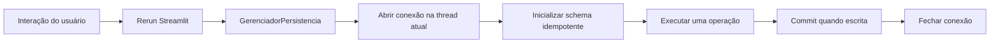

# Conexão SQLite compatível com reruns do Streamlit Design

**Spec**: `.specs/features/corrigir-sqlite-streamlit/spec.md`
**Status**: Approved

## Architecture Overview

O `GerenciadorPersistencia` passa a armazenar apenas o caminho do banco. Cada método público abre uma conexão configurada na própria thread, aplica a criação/migração idempotente, executa uma única operação e fecha a conexão ao sair. `ChatComMemoria` e `app_streamlit.py` continuam recebendo e guardando o mesmo gerenciador, mas esse objeto não carrega uma conexão compartilhada entre reruns.

## Code Reuse Analysis

### Existing Components to Leverage

| Component | Location | How to Use |
| --------- | -------- | ---------- |
| `GerenciadorPersistencia` | `persistencia.py:7-145` | Preservar sua API e SQL parametrizado; trocar apenas o dono/ciclo de vida da conexão. |
| Migração `_migrar_schema` | `persistencia.py:35-51` | Receber a conexão da operação e continuar idempotente. |
| `ChatComMemoria` | `chat_openai_memoria.py:424-442`, `549-621` | Continuar chamando os mesmos métodos para thread, mensagens e turnos. |
| Wiring Streamlit | `app_streamlit.py:24-85` | Não alterar a guarda em `st.session_state`; o gerenciador torna-se seguro ao ser reusado. |
| Testes `AppTest` | `tests/test_app_streamlit_ui.py:37-100` | Adicionar a regressão no estilo existente, com rerun e estado de sessão. |

### Integration Points

| System | Integration Method |
| ------ | ------------------ |
| Streamlit | Mantém o objeto gerenciador e o chat em `st.session_state`; cada chamada posterior cria sua própria conexão. |
| SQLite | Cada operação aplica `row_factory`, `PRAGMA foreign_keys = ON` e schema/migração antes da query. |
| CLI | Continua usando os métodos públicos e `fechar()` sem mudança de chamada. |
| OpenAI | No teste de regressão, a resposta e `usage` são simulados para exercitar a persistência sem rede. |

## Components

### Gerenciador de conexão por operação

- **Purpose**: Abrir, configurar, inicializar e fechar a conexão SQLite na thread que invoca uma operação.
- **Location**: `persistencia.py`
- **Interfaces**:
  - `_conexao()` como helper privado de contexto, que fornece uma `sqlite3.Connection` configurada.
  - `_criar_tabelas(conn)` e `_migrar_schema(conn)`, helpers privados que recebem a conexão atual.
- **Dependencies**: `sqlite3`, `contextlib` e `BANCO_CAMINHO_PADRAO` existentes.
- **Reuses**: DDL, migração, consultas parametrizadas e formato de retorno existentes.

### Operações de persistência

- **Purpose**: Executar uma consulta ou gravação isolada por chamada pública.
- **Location**: `persistencia.py`
- **Interfaces**: As assinaturas públicas atuais permanecem: `criar_thread`, `salvar_mensagem`, `listar_threads`, `carregar_historico`, `excluir_thread`, `thread_existe`, `salvar_turno`, `carregar_turnos`, `total_tokens_thread` e `fechar`.
- **Dependencies**: Gerenciador de conexão por operação.
- **Reuses**: O SQL e os retornos já observados em `tests/test_persistencia.py`.

### Regressão de rerun Streamlit

- **Purpose**: Provar que a segunda execução da tela não usa a conexão da primeira thread e que o primeiro turno é gravado.
- **Location**: `tests/test_app_streamlit_ui.py`
- **Interfaces**: `streamlit.testing.v1.AppTest`, ambiente temporário e mock da resposta OpenAI.
- **Dependencies**: `GerenciadorPersistencia`, `ChatComMemoria` e a UI existente.
- **Reuses**: O padrão de `AppTest.from_file(...).run()` já usado pela suíte.

## Data Models

O schema não muda. As tabelas `threads`, `mensagens` e `turnos`, seus relacionamentos e valores nulos de uso de tokens permanecem como estão. A mudança é somente no ciclo de vida da conexão que as acessa.

`GerenciadorPersistencia(":memory:")` não é compatível com conexões novas por operação, pois cada conexão SQLite em memória cria uma base distinta. Os testes de persistência passarão a usar um arquivo SQLite temporário por caso de teste, mantendo isolamento e comportamento observável equivalentes.

## Error Handling Strategy

| Error Scenario | Handling | User Impact |
| -------------- | -------- | ----------- |
| Rerun em thread diferente | A operação abre uma conexão da thread atual. | Sidebar e chat continuam sem `sqlite3.ProgrammingError`. |
| Falha SQLite não relacionada, como lock ou permissão | Não capturar nem mudar o contrato nesta feature. | Mantém o comportamento atual; melhoria de UX fica registrada como ideia adiada. |
| Falha durante inicialização/migração | Propagar a exceção e fechar a conexão criada pelo helper. | Sem recurso a estado parcialmente compartilhado. |

## Risks & Concerns

| Concern | Location | Impact | Mitigation |
| ------- | -------- | ------ | ---------- |
| Uma conexão é guardada em `st.session_state` entre reruns. | `app_streamlit.py:24-31`, `persistencia.py:8-13` | Bloqueia a primeira conversa com `sqlite3.ProgrammingError`. | O gerenciador conservará apenas o caminho; a conexão viverá por operação. |
| Testes acessam o detalhe interno `db.conn` e usam `:memory:`. | `tests/test_persistencia.py:8-16`, `tests/test_persistencia.py:104-111` | A nova estratégia invalidaria o fixture e os testes sem indicar regressão funcional. | Trocar o fixture por arquivo temporário e verificar schema/efeitos pelo banco ou pela API pública. |
| A UI atual não cobre um chat persistido real em duas renderizações. | `tests/test_app_streamlit_ui.py:37-100` | A regressão chegou à aplicação apesar dos testes verdes. | Adicionar um `AppTest` com persistência e resposta OpenAI simulada, exercitando renderização inicial e envio. |
| O construtor de `ChatComMemoria` escreve caracteres Unicode no stdout. | `chat_openai_memoria.py:241-258` | Em alguns runners com cp1252, um teste de UI real pode falhar antes da persistência. | Silenciar stdout somente no teste de regressão; a correção de encoding é fora de escopo. |

## Tech Decisions

| Decision | Choice | Rationale |
| -------- | ------ | --------- |
| Compartilhamento de conexão | Não usar `check_same_thread=False` nem lock global. | A documentação do Python exige serialização de escritas nesse modo; conexão por operação mantém a proteção padrão e simplifica a demonstração educacional. |
| Inicialização do schema | Executar DDL/migração idempotente ao abrir cada conexão. | Mantém o comportamento de bancos antigos sem uma conexão de longa duração. |
| Isolamento dos testes | Usar arquivo temporário, não `:memory:`. | Cada operação abre uma nova conexão, e `:memory:` não é compartilhado entre elas. |
| Escopo do front-end | Não alterar `app_streamlit.py` salvo se o teste revelar necessidade objetiva. | A falha está no recurso compartilhado; o wiring já preserva o estado previsto. |

`AD-001` em `.specs/STATE.md` registra a decisão transversal de ciclo de vida da conexão.
