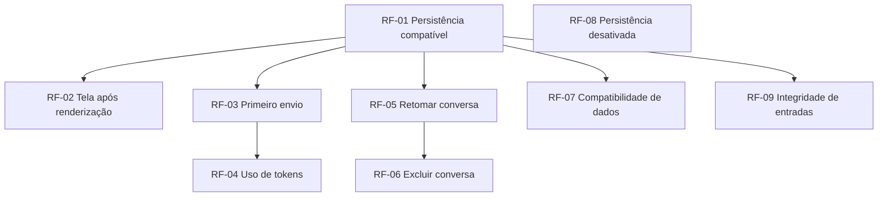

# PRD — Continuidade de conversas persistidas na interface web

**Data:** 2026-09-20  
**Autor(es):** Codex  
**Status:** rascunho

> **TL;DR.** Pessoas que usam o chat pela interface web com persistência local poderão iniciar, retomar e administrar conversas sem que uma nova renderização interrompa o fluxo, preservando mensagens e dados de uso já gravados.

---

## Contexto

O projeto educacional oferece um chat com memória que pode guardar conversas localmente. A persistência é usada tanto pela interface web quanto pelo modo de terminal, permitindo listar conversas, retomá-las, excluí-las e consultar o histórico e o consumo de tokens de cada interação.

Na interface web, cada interação do usuário pode renderizar a página novamente. O estado da sessão mantém os objetos necessários para a conversa entre essas renderizações. Essa característica é desejável para preservar o contexto da pessoa usuária, mas hoje pode interromper o fluxo quando a persistência local está ativa.

O público afetado são estudantes e pessoas que experimentam o chat pela interface web com conversas persistidas. Também são afetadas pessoas que já possuem conversas salvas e usam o modo de terminal, pois a correção precisa manter o comportamento compartilhado de persistência.

## Problema

Ao enviar a primeira mensagem depois de uma nova renderização da página, a pessoa usuária pode receber um erro de conexão criado em outra execução. O erro aparece antes ou durante a interação normal da tela, bloqueia o início da conversa e impede que uma funcionalidade apresentada como persistente seja usada de forma confiável.

O impacto é maior no primeiro uso após a página ser atualizada: a pessoa não consegue concluir um fluxo básico de criar ou continuar uma conversa, mesmo com o armazenamento local configurado. Há também o risco de uma correção focada apenas na tela alterar conversas existentes ou prejudicar o modo de terminal, que usa a mesma persistência.

## Objetivo

Garantir que a interface web mantenha conversas persistidas utilizáveis após novas renderizações, sem erros causados pela troca de execução da página, e que os dados e comportamentos de persistência já disponíveis continuem íntegros.

## Escopo

- Permitir que a tela renderize novamente com persistência local ativa e continue pronta para uso.
- Permitir iniciar uma primeira conversa persistida após a renderização inicial.
- Manter mensagens e dados de uso de tokens associados à conversa correta.
- Permitir listar, retomar e excluir conversas persistidas depois de novas renderizações.
- Preservar conversas existentes e o comportamento da persistência consumido pela interface web e pelo terminal.
- Manter a opção de executar a interface sem persistência local, sem criar armazenamento local como efeito do fluxo.

## Fora de escopo

- **Autenticação e isolamento de conversas entre múltiplos usuários.** *Por quê:* o defeito atual ocorre em uma sessão local e não define um modelo de acesso multiusuário.
- **Substituição do armazenamento local, adoção de um ORM ou serviço de banco remoto.** *Por quê:* a demanda corrige a continuidade de uso do armazenamento existente e deve conservar o caráter didático do projeto.
- **Novo desenho visual da interface ou mudança da API pública do chat.** *Por quê:* a experiência visual e o contrato de uso atual não são a causa da interrupção.
- **Tratamento de indisponibilidade do arquivo, corrupção ou contenção externa do banco.** *Por quê:* são falhas distintas, que exigem política de experiência do usuário e escopo próprios.

## Requisitos funcionais

- **RF-01.** Quando a persistência local estiver ativa, cada interação de persistência é executada de forma compatível com a execução que a solicitou, sem depender de uma execução anterior da página.  
  **Depende de:** nenhuma.

- **RF-02.** Após uma nova renderização da interface web, a pessoa usuária consegue visualizar a lista de conversas e o campo de mensagem sem receber erro de uso de uma conexão criada em outra execução.  
  **Depende de:** RF-01 (pré-requisito).

- **RF-03.** Ao enviar a primeira mensagem não vazia após a renderização inicial, a pessoa usuária cria ou continua a conversa ativa e as mensagens da pessoa e do assistente ficam registradas na ordem em que ocorreram.  
  **Depende de:** RF-01 (pré-requisito).

- **RF-04.** Quando o provedor informar o uso de tokens de uma interação persistida, a conversa registra as quantidades de entrada, saída e total correspondentes àquela interação.  
  **Depende de:** RF-03 (dados da interação).

- **RF-05.** Uma conversa salva anteriormente pode ser listada e retomada na interface web, inclusive quando isso ocorre após uma nova renderização.  
  **Depende de:** RF-01 (pré-requisito).

- **RF-06.** A pessoa usuária consegue excluir uma conversa pela lista da interface web e continuar usando a tela após a renderização subsequente, sem reexibir a conversa excluída.  
  **Depende de:** RF-05 (dados e fluxo).

- **RF-07.** Conversas, mensagens e registros de uso já salvos permanecem disponíveis, e as capacidades atuais de criar, listar, retomar, excluir e consultar conversas continuam disponíveis também no modo de terminal.  
  **Depende de:** RF-01 (compatibilidade de persistência).

- **RF-08.** Quando a persistência local estiver desativada, o fluxo da interface web não cria nem acessa um armazenamento local de conversas.  
  **Depende de:** nenhuma.

- **RF-09.** Conteúdo de mensagens e identificadores de conversas são tratados como dados no armazenamento, inclusive quando contêm caracteres especiais, sem provocar execução de instruções não solicitadas ou alteração de outras conversas.  
  **Depende de:** RF-01 (persistência compatível).

### Dependências entre requisitos

**Matriz:**

| RF | Depende de | É pré-requisito de | Tipo principal |
| --- | --- | --- | --- |
| RF-01 | — | RF-02, RF-03, RF-05, RF-07, RF-09 | base |
| RF-02 | RF-01 | — | pré-requisito |
| RF-03 | RF-01 | RF-04 | pré-requisito |
| RF-04 | RF-03 | — | dados |
| RF-05 | RF-01 | RF-06 | pré-requisito |
| RF-06 | RF-05 | — | dados e fluxo |
| RF-07 | RF-01 | — | compatibilidade |
| RF-08 | — | — | base independente |
| RF-09 | RF-01 | — | integridade de dados |

**Grafo:**

**Ordem de implementação sugerida:**

1. RF-01 e RF-08 (bases independentes).
2. RF-02, RF-03, RF-05, RF-07 e RF-09 (dependem apenas de RF-01; podem seguir em paralelo).
3. RF-04 (depende de RF-03) e RF-06 (depende de RF-05).

**Caminho crítico:** RF-01 → RF-03 → RF-04 e RF-01 → RF-05 → RF-06.  
**Ciclos:** nenhum. **Dependências externas:** disponibilidade do armazenamento local já configurado e resposta do provedor para os dados de uso de tokens.

## Critérios de aceite

- **CA-01 (RF-01, RF-02).** *Dado* que a persistência local está ativa, *quando* a página é renderizada e renderizada novamente, *então* a lista de conversas e o campo de mensagem permanecem disponíveis sem exibir erro de conexão pertencente a outra execução.

- **CA-02 (RF-03).** *Dado* uma página recém-renderizada com persistência local ativa, *quando* a pessoa envia sua primeira mensagem não vazia, *então* uma conversa ativa é criada ou reutilizada e há uma mensagem da pessoa seguida pela resposta do assistente no histórico persistido.

- **CA-03 (RF-04).** *Dado* que a resposta a uma mensagem informa as três quantidades de uso de tokens, *quando* a interação é persistida, *então* a conversa contém um registro associado à interação com as quantidades de entrada, saída e total informadas pelo provedor.

- **CA-04 (RF-05).** *Dado* uma conversa salva antes de uma nova renderização, *quando* a pessoa a seleciona na lista, *então* o histórico apresentado corresponde às mensagens salvas daquela conversa, na ordem original.

- **CA-05 (RF-06).** *Dado* uma conversa visível na lista, *quando* a pessoa a exclui e a página é renderizada novamente, *então* a conversa deixa de aparecer na lista e não pode mais ser retomada.

- **CA-06 (RF-07).** *Dado* um armazenamento local já preenchido com conversas, mensagens e registros de uso, *quando* a versão corrigida é usada, *então* os registros existentes permanecem consultáveis e os fluxos atuais de criar, listar, retomar e excluir conversas funcionam tanto na interface web quanto no terminal.

- **CA-07 (RF-08).** *Dado* que a persistência local está desativada, *quando* a interface web é renderizada e recebe uma mensagem, *então* o fluxo não cria nem acessa um arquivo de armazenamento local de conversas.

- **CA-08 (RF-09).** *Dado* uma mensagem ou identificador contendo aspas, apóstrofos ou outros caracteres especiais, *quando* ele é usado em um fluxo de persistência, *então* seu conteúdo é mantido como dado literal e nenhuma conversa fora do alvo é alterada ou removida.

- **CA-09 (RF-01, RF-03, RF-04).** *Dado* uma resposta simulada do provedor com dados completos de uso, *quando* a interface conclui uma renderização inicial e outra com o envio de mensagem, *então* não ocorre erro de conexão entre execuções e o armazenamento contém exatamente uma conversa ativa, duas mensagens ordenadas e um registro de uso associado ao envio.

## Impactos/restrições técnicas relevantes

- A correção deve preservar o armazenamento local e sua estrutura atual, inclusive dados já existentes e os relacionamentos entre conversas, mensagens e registros de uso.
- A persistência precisa permanecer segura quando a interface web renderiza novamente em uma execução diferente; não pode reduzir as proteções padrão de concorrência do armazenamento local.
- O modo de terminal e a interface web mantêm as mesmas capacidades públicas de persistência; consumidores existentes não devem precisar alterar como usam o recurso.
- Operações de gravação continuam curtas e confirmadas por interação. Esta demanda não introduz coordenação global entre processos nem altera os limites de espera já adotados pelo armazenamento.
- Falhas de armazenamento que não sejam causadas pela troca de execução da página mantêm o comportamento atual. Mensagens de experiência do usuário para falhas de bloqueio, permissão ou corrupção ficam fora deste escopo.

## Riscos e pontos de atenção

- **Risco técnico.** Mais de um processo pode tentar alterar o mesmo armazenamento local e gerar contenção, um problema diferente da interrupção entre renderizações. *Mitigação:* preservar operações curtas e não prometer tratamento novo para essa condição nesta entrega.
- **Risco técnico.** Abrir o acesso ao armazenamento a cada interação pode acrescentar pequena latência. *Mitigação:* validar o fluxo completo de interface e manter o escopo da operação limitado à ação solicitada.
- **Risco de produto.** A correção pode parecer resolver todas as falhas de persistência, embora indisponibilidade física, permissões e corrupção não sejam cobertas. *Mitigação:* explicitar esses limites na documentação e nas mensagens de suporte da demanda.
- **Ponto de atenção.** A evidência de regressão deve simular o provedor de IA e usar armazenamento isolado; testes que dependam de rede ou de conversas locais do repositório não comprovam a experiência da pessoa usuária.

---

## Métricas de sucesso

- **Métrica primária.** No cenário automatizado de renderização inicial seguida do primeiro envio com persistência ativa, não há erro de conexão entre execuções e a conversa, suas duas mensagens e o registro de uso informado pelo provedor são persistidos.
- **Métrica de compatibilidade.** A suíte de persistência e os fluxos existentes de interface web e terminal permanecem aprovados após a entrega.
